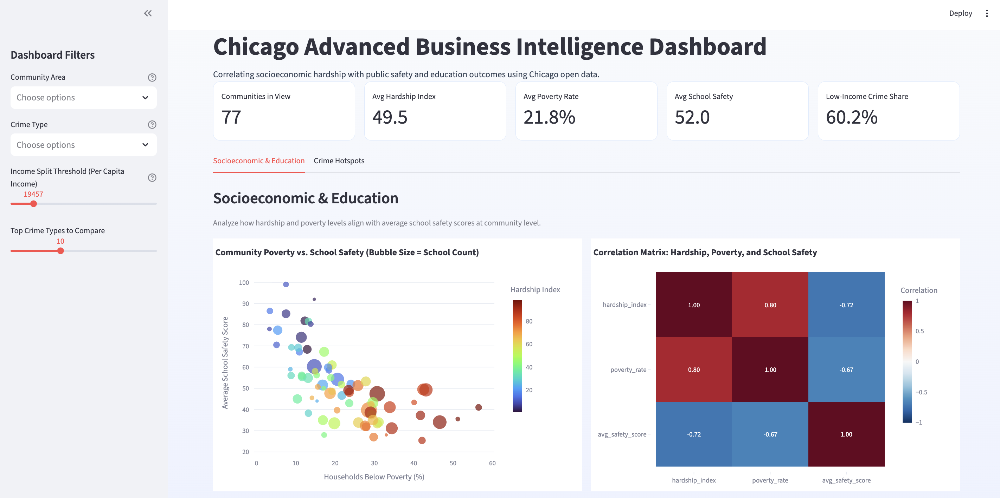
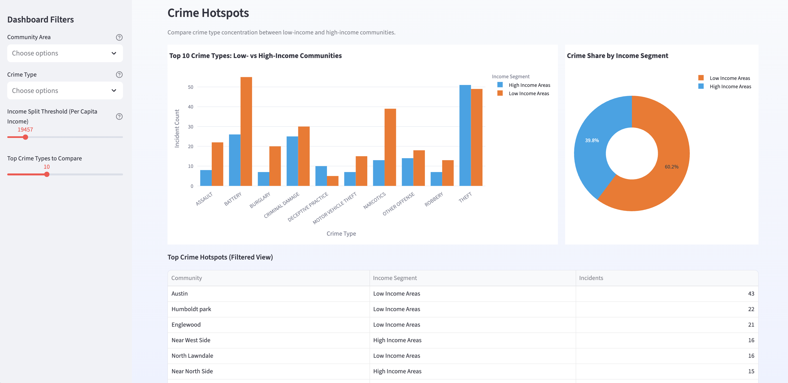

# Chicago Data Analysis - SQL Project

[](https://www.python.org/downloads/)
[](LICENSE)
[](https://github.com/yourusername/chicago-data-analysis)
[]()

A comprehensive SQL analysis project examining socioeconomic indicators, public schools, and crime data for Chicago communities.

---

## 📋 Overview

This project analyzes three interconnected datasets from the City of Chicago to answer critical questions about community health, safety, and education. Using SQLite and Python, the project demonstrates SQL querying capabilities including joins, subqueries, aggregation, and filtering.

### Datasets

1. **Chicago Census Data** (2008-2012)
   - Socioeconomic indicators including income, poverty rates, and hardship index
   - 77 community areas

2. **Chicago Public Schools**
   - School-level performance data for 2011-2012
   - Safety scores and school types

3. **Chicago Crime Data** (2001-Present)
   - Reported crime incidents across Chicago
   - Location, type, and case information

## 🚀 Quick Start

### Prerequisites

- Python 3.7+
- Git
- ~2 MB disk space for database

### Installation & Setup (Recommended)

The easiest way to get started is using the automated setup script:

```bash
# Clone the repository
git clone https://github.com/yourusername/chicago-data-analysis.git
cd chicago-data-analysis

# Run the setup script
chmod +x setup.sh
./setup.sh

# Run the analysis
python chicago_data_analysis.py
```

### Manual Installation

If you prefer manual setup:

1. Clone the repository:
```bash
git clone https://github.com/yourusername/chicago-data-analysis.git
cd chicago-data-analysis
```

2. Create a virtual environment:
```bash
python3 -m venv venv
source venv/bin/activate  # On Windows: venv\Scripts\activate
```

3. Install dependencies:
```bash
pip install -r requirements.txt
```

4. Run the analysis:
```bash
python chicago_data_analysis.py
```

### Expected Output

The script will:
1. Download the Chicago datasets (~2 MB total)
2. Create a SQLite database (`FinalDB.db`)
3. Execute 10 SQL analysis queries
4. Display results in a formatted table

First run takes 2-3 minutes due to data download. Subsequent runs are faster using cached database.

## 🌟 Advanced Business Intelligence Dashboard

This project now includes an interactive BI application: `chicago_bi_dashboard.py`.
It reads directly from `FinalDB.db` and transforms the original SQL project into a decision-support dashboard.

### What the dashboard does

- Adds a filter sidebar for community area and crime type analysis
- Displays executive KPIs (hardship, poverty, school safety, and crime segmentation)
- Includes a **Socioeconomic & Education** tab to analyze relationships between:
  - Hardship Index
  - Poverty Rate
  - Average School Safety Score
- Includes a **Crime Hotspots** tab to compare most common crime types in low-income vs high-income areas

### Business value

- Correlates socioeconomic hardship with public safety and education outcomes
- Helps identify communities where social risk and safety challenges overlap
- Supports prioritization of interventions using evidence-based visual analytics

### Run the dashboard

1. Generate or refresh the SQLite database:
```bash
python chicago_data_analysis.py
```

2. Launch the BI dashboard:
```bash
streamlit run chicago_bi_dashboard.py
```

3. Open the local Streamlit URL shown in your terminal (usually `http://localhost:8501`)

### Deploy on Streamlit Community Cloud

1. Push this repository to GitHub.
2. Go to `https://share.streamlit.io`.
3. Create a new app and select `chicago_bi_dashboard.py` as the entry point.

Important:
- `FinalDB.db` is intentionally excluded from Git (`.gitignore`).
- On first cloud startup, the dashboard now auto-builds `FinalDB.db` by running the existing ETL logic from `chicago_data_analysis.py`.
- The first load can take a few minutes because datasets are downloaded and written to SQLite.

### Dashboard Preview





### How the dashboard was built

The dashboard was built in `chicago_bi_dashboard.py` using a modular BI workflow:

1. **Data access layer (SQLite + SQL)**
   - Reads directly from `FinalDB.db` using `sqlite3` and `pandas.read_sql_query`
   - Uses `LEFT JOIN` queries to combine:
     - `CENSUS_DATA` (hardship, poverty, income)
     - `CHICAGO_PUBLIC_SCHOOLS` (safety scores)
     - `CHICAGO_CRIME_DATA` (crime events and types)

2. **Data quality and missing-value handling**
   - Uses `COALESCE` and conditional SQL aggregation (`AVG(CASE WHEN ...`) for null-safe metrics
   - Applies numeric casting/conversion with `pd.to_numeric(..., errors='coerce')`
   - Excludes or labels incomplete rows safely (for example, unknown income segment)

3. **Interactive filtering and segmentation**
   - Streamlit sidebar filters for:
     - Community area
     - Crime type
     - Income threshold split (low-income vs high-income)
   - Dynamic filtering updates all KPIs and charts in real time

4. **BI visualization layer (Plotly + Streamlit)**
   - KPI cards for executive-level monitoring
   - **Socioeconomic & Education tab**:
     - Bubble scatter plot (poverty vs safety, colored by hardship)
     - Correlation heatmap (hardship, poverty, safety)
   - **Crime Hotspots tab**:
     - Grouped bar comparison of top crime types by income segment
     - Donut chart for low-income vs high-income crime share
     - Hotspot table for most affected communities

5. **Performance and usability**
   - Uses Streamlit caching (`@st.cache_data`) to keep interactions responsive
   - Professional layout with custom styling, clear tab organization, and business-focused narrative

## 📊 Problems Solved

### Problem 1: Total Crime Count
**Question:** Find the total number of crimes recorded in the CRIME table.

This query provides a basic count of all crime incidents in the database.

### Problem 2: Low-Income Communities
**Question:** List community area names and numbers with per capita income less than $11,000.

Identifies economically disadvantaged communities for targeted support programs.

### Problem 3: Crimes Involving Minors
**Question:** List all case numbers for crimes involving minors.

Filters crimes where minors are mentioned in the description, highlighting juvenile involvement.

### Problem 4: Kidnapping of Children
**Question:** List all kidnapping crimes involving a child.

Combines two filters to identify the most serious crimes against children.

### Problem 5: School-Related Crimes
**Question:** List the kind of crimes that were recorded at schools (no repetitions).

Uses DISTINCT clause to identify unique crime types at educational institutions.

### Problem 6: School Safety Analysis
**Question:** List the type of schools along with the average safety score for each type.

Demonstrates GROUP BY aggregation and provides comparative safety metrics.

### Problem 7: Poverty-Stricken Communities
**Question:** List 5 community areas with the highest percentage of households below poverty line.

Identifies the most economically challenged communities using ORDER BY and LIMIT.

### Problem 8: Crime Hotspot
**Question:** Which community area is most crime prone?

Uses GROUP BY and aggregation to identify the area with the highest crime volume.

### Problem 9: Hardship Index Leader (Subquery)
**Question:** Use a sub-query to find the name of the community area with the highest hardship index.

Demonstrates subquery usage to find maximum values.

### Problem 10: Most Crimes by Community (Subquery)
**Question:** Use a sub-query to determine the Community Area Name with the most number of crimes.

Advanced subquery combining crime count with census data lookup.

## 📁 Project Structure

``` 
chicago-data-analysis/
├── chicago_data_analysis.py    # Main analysis script
├── chicago_bi_dashboard.py     # Advanced BI dashboard (Streamlit + Plotly)
├── FinalDB.db                  # SQLite database (generated)
├── assets/
│   ├── dashboard_screenshot_1.png
│   └── dashboard_screenshot_2.png
├── README.md                   # This file
└── .gitignore                  # Git ignore rules
```

## 🔧 Code Structure

### ChicagoDataAnalysis Class

The main class handles:
- Database connection management
- Data loading from remote CSV files
- Table creation
- Query execution
- Results formatting and display

#### Key Methods

- `connect_db()`: Establishes SQLite connection
- `load_data_from_urls()`: Downloads and ingests CSV data
- `store_data_to_db()`: Creates database tables from DataFrames
- `execute_query()`: Runs SQL queries and returns results as DataFrames
- `display_results()`: Formats and prints query results
- `run_analysis()`: Executes all 10 analysis problems

## 📈 Sample Output

```
======================================================================
PROBLEM 1: Find the total number of crimes recorded
======================================================================
TOTAL_CRIMES
17956

  → Total records: 1

======================================================================
PROBLEM 2: Community areas with per capita income < $11,000
======================================================================
COMMUNITY_AREA_NUMBER  COMMUNITY_AREA_NAME  PER_CAPITA_INCOME
                    24  Brighton Park                 10841
                    36  West Englewood                10724
                    69  Riverdale                      8201
...
```

## 🔍 SQL Concepts Demonstrated

- **SELECT Statements**: Basic data retrieval
- **WHERE Clause**: Conditional filtering
- **GROUP BY**: Data aggregation
- **ORDER BY**: Result sorting
- **LIMIT**: Result limiting
- **DISTINCT**: Removing duplicates
- **LIKE**: Pattern matching
- **Subqueries**: Nested query operations
- **COUNT()**: Aggregation function
- **MAX()**: Finding maximum values
- **AVG()**: Calculating averages

## 📊 Data Sources

All datasets are sourced from the [City of Chicago Data Portal](https://data.cityofchicago.org):

- Census Data: https://data.cityofchicago.org/Health-Human-Services/Census-Data-Selected-socioeconomic-indicators-in-C/kn9c-c2s2
- Public Schools: https://data.cityofchicago.org/Education/Chicago-Public-Schools-Progress-Report-Cards-2011-/9xs2-f89t
- Crime Data: https://data.cityofchicago.org/Public-Safety/Crimes-2001-to-present/ijzp-q8t2

## 🎓 Learning Outcomes

This project helps learners master:
- SQL query fundamentals
- Database design and creation
- Data import and export
- Python's sqlite3 module
- Pandas DataFrame manipulation
- Data analysis and visualization concepts

## 💡 How to Extend This Project

### Suggestions for Enhancement

1. **Add Visualization**: Use matplotlib/seaborn to visualize results
   ```python
   import matplotlib.pyplot as plt
   result_df.plot(kind='bar')
   plt.show()
   ```

2. **Export Reports**: Generate PDF or Excel reports using openpyxl
   ```python
   result_df.to_excel('analysis_report.xlsx', index=False)
   ```

3. **Add More Queries**: 
   - Average crime rate by district
   - School performance vs. community safety correlation
   - Temporal crime trends

4. **Performance Analysis**: 
   - Add query execution timing
   - Create indexes on commonly filtered columns
   - Compare query optimization strategies

5. **Web Dashboard**: 
   - Build Flask app to serve interactive reports
   - Create REST API endpoints
   - Add data filtering UI

6. **Data Validation**: 
   - Add data quality checks
   - Validate data types and ranges
   - Generate data quality reports

7. **Error Handling**: 
   - Implement comprehensive error logging
   - Add retry mechanisms for network failures
   - Create error recovery procedures

8. **Docker Deployment**:
   - Containerize the application
   - Deploy to cloud platforms
   - Enable CI/CD workflows

9. **Advanced Analytics**:
   - Machine learning on crime patterns
   - Predictive modeling for hotspots
   - Statistical analysis and hypothesis testing

10. **Multi-Language Support**:
    - Support for different languages in output
    - Internationalization (i18n) framework

## 🎓 What You'll Learn

- **SQL Fundamentals**: SELECT, WHERE, GROUP BY, aggregations
- **Subqueries**: Nested queries for complex operations
- **Database Design**: Table creation and relationships
- **Python Integration**: Using sqlite3 with Python
- **Data Analysis**: Pandas for data manipulation
- **Best Practices**: Code organization and documentation

## 🐛 Troubleshooting

### Issue: "ModuleNotFoundError: No module named 'pandas'"
**Solution**: Install pandas using `pip install pandas`

### Issue: "No data loaded" or empty tables
**Solution**: Check internet connection. The script downloads data from remote URLs.

### Issue: Database lock error
**Solution**: Ensure no other process is accessing `FinalDB.db`. Delete the file and rerun.

## 📝 Notes

- The script automatically creates and overwrites the SQLite database on each run
- Large crime dataset may take a few minutes to download on first run
- Results are cached in the database after initial creation
- All queries are read-only and don't modify data

## 📄 License

This project is licensed under the MIT License - see LICENSE file for details.

## 👥 Authors

- **Original Course**: IBM Developer Skills Network
- **Course**: Databases and SQL
- **Instructors**: Hima Vasudevan, Rav Ahuja, Ramesh Sannreddy
- **Contributors**: Malika Singla, Abhishek Gagneja

## 🙏 Acknowledgments

- City of Chicago for providing open data
- IBM Developer Skills Network for course curriculum
- Coursera for hosting the course

## 📞 Support

For issues or suggestions:
1. Check this README for troubleshooting
2. Review the code comments in `chicago_data_analysis.py`
3. Consult SQL documentation for query syntax
4. Open an issue on GitHub

---

**Last Updated**: February 2026 | **Python Version**: 3.7+ | **Database**: SQLite3
